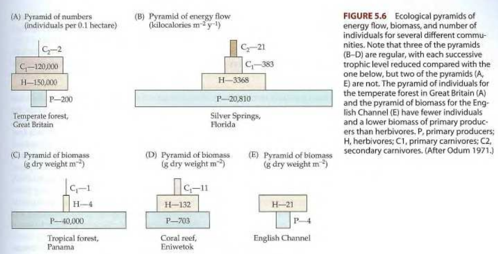

```{r setup, include=FALSE}
knitr::opts_chunk$set(echo = FALSE)
```

## Introducción

Definiciones, algo arbitrarias pero útiles para separar conceptos:

- **Población:** Grupo de individuos de la **misma especie** que viven en un área determinada.
- **Comunidad:** Conjunto de **poblaciones de diferentes especies** que interactúan en un área.
- **Hábitat:** **Entorno** "natural" donde vive una especie.
- **Ecosistema:** **Comunidad** de seres vivos **y su entorno** físico interactuando como un sistema.
- **Bioma:** **Gran región** caracterizada por un tipo específico de clima, flora y fauna.

## Introducción

* **Distribución y abundancia** de una especie siempre resultan afectados por otras especies.

* Debido a las interacciones entre organismos, normalmente las distribuciones de especies suelen ser **mutuamente excluyentes a escala local**, o tienden a ocurrir de forma conjunta en complejas comunidades ecológicas.

* Las comunidades vistas como un superorganismo se atribuye a **Clements** (especies como células).

* En contraste, la comunidad vista como unidad discreta e integrada, se atribuye a **Gleason**.

## Introducción (cont.)

* Ambas corrientes hicieron aportes relevantes.
    * Las comunidades exhiben **atributos como los de un individuo** ("productividad primaria total").
    
    * Por otra parte, las especies también varían en "ocurrencia" y abundancia **como si fuesen organismos indpendientes** unos de otros.

* Climas diferentes inducen tipos de __vegetación distintos__ (zonas de vida, biomas, ecorregiones).

## Introducción (cont.)

* Ejemplos: ...

* Consultar mapas modelos idealizados, pags. 15 y 39 de @bailey2014ecoregions.

* Consultar Mapa de tipos de regímenes bioclimáticos, @camara2020tbrs

## 
Tomado de @bailey2014ecoregions

## 
Tomado de @bailey2014ecoregions

## {width=90%}
Tomado de @camara2020tbrs

## Comunidades y ecosistemas

* Je je, __tremendo lío__, definiciones arbitrarias.

* Las comunidades y los ecosistemas son los niveles de organización biótica y ecológica __más altos__, pero comúnmente se definen de forma arbitraria.

## Comunidades y ecosistemas (cont.)

### Comunidad

* La comunidad consiste en el __conjunto de especies que viven en el mismo lugar__.

* Un miembro de la comunidad puede definirse __taxonómicamente__ o por medio de atributos/rasgos __funcionales__ (e.g. formas de vida, dieta).

* Dos atributos son recurrentemente estudiados en la comunidad: __estructura__ (atributos estáticos) y __funciones__ (atributos dinámicos).

* Los límites se establecen __arbitrariamente__, aunque los __rasgos topográficos__ son usados también.

## Comunidades y ecosistemas (cont.)

### Ecosistemas

* Incluye no sólo las especies que habitan en el lugar, sino también los __rasgos/atributos/características físicas__ del mismo, así como las interacciones entre los componentes bióticos y abióticos del sistema.

* __Los ecosistemas no están aislados__, aunque lo parezcan. El ecosistema más grande y aislado del resto es la biosfera, pero dentro de ella, es difícil separar subunidades que se consideren absolutamente aisladas.

## Comunidades y ecosistemas (cont.)

### Consideraciones energéticas

* Cada __especie tiene un nicho, y el cómo se organizan__ para dar lugar a asociaciones complejas entre poblaciones, __es el objetivo último de la ecología__.

* Dos rasgos fundamentales de las especies que influyen en la comunidad son su __masa/volumen corporal__ y su __estado trófico o condición trófica__.

## Comunidades y ecosistemas (cont.)

### Consideraciones energéticas (cont.)

#### Masa corporal

* Su influencia sobre el ecosistema es significativamente alta.

* A __mayor tamaño/masa, mayor consumo__ energético. La tasa de metabolismo basal es clave; $m=cM^{0.75}$, donde $m$ es la tasa de metabolismo basal, $M$ la masa corporal, $c$ una constante que varía entre grupos taxonómicos; el exponente $0.75$, que es la pendiente, es relativamente constante.

## Comunidades y ecosistemas (cont.)

### Consideraciones energéticas (cont.)

#### Masa corporal

* Hay más especies de animales pequeños, y son igualmente más abundantes, que grandes.

* Las __especies grandes__ (al menos en animales), tienden a tener __ámbitos geográficos amplios__.

## Comunidades y ecosistemas (cont.)

### Consideraciones energéticas (cont.)

#### Masa corporal

* La __capacidad de carga__ del ambiente es limitada, por lo que los animales grandes tienden a aumentar su rango para compensar esta limitación.

* Ver figuras 5.2 y 5.3, páginas 125 y 126 de @lomolino2006biogeography.

## {width=90%}
Tomado de @lomolino2006biogeography

## {width=80%}
Tomado de @lomolino2006biogeography

## Comunidades y ecosistemas (cont.)

### Consideraciones energéticas (cont.)

#### Estado trófico

* Se refiere a __cómo los organismos adquieren su energía__, y es el otro rasgo que influye significativamente en la comunidad.

* El tamaño corporal tiene efecto sobre el estado trófico. Los __depredadores suelen ser más grandes que su presa__, a menos que la especie realice caza en manadas.

## Comunidades y ecosistemas (cont.)

### Consideraciones energéticas (cont.)

#### Estado trófico

* Los organismos obtienen __su energía del sol__ (salvo contadas excepciones).

* Las plantas, autótrofos, producen __compuestos orgánicos a partir de radiación solar__, dióxido de carbono, minerales y agua.

* __Además de usarlo en su metabolismo, las plantas producen estos compuestos para otros organismos__ que se alimentan de ellos, y otros organismos se alimentan de estos últimos.


## Comunidades y ecosistemas (cont.)

### Consideraciones energéticas (cont.)

#### Estado trófico

* El diseño de trayectorias unidireccionales de la energía que fluye entre especies y a través de comunidades se denomina __cadenas tróficas__. Los nodos de la misma se denominan __niveles tróficos__.

* El primer nivel contiene plantas, o __productores primarios__. El segundo contiene herbívoros, o __consumidores primarios__. El tercero __carnívoros__ o consumidores, y así sucesivamente. Al final de las cadenas están los __descomponedores o detritívoros__.


## Comunidades y ecosistemas (cont.)

### Consideraciones energéticas (cont.)

#### Estado trófico

* Aunque la __energía fluye linealmente__, los trayectos que sigue la energía son muy variados. Un consumidor se alimenta comúnmnente de __varias especies__, y varios __descomponedores lo consumirán__, formando una red trófica (distintas cadenas interconectadas; ver figura 5.5, página 127 de @lomolino2006biogeography).
* La energía fluye a través de las comunidades siguiendo la __primera__ (la energía ni se crea ni se destruye) y la __segunda ley de la termodinámica__ (a mayor conversión de la energía, menor su capacidad de producir trabajo, su caos/entropía aumenta).


## Comunidades y ecosistemas (cont.)

### Consideraciones energéticas (cont.)

#### Estado trófico

* Capacidad de carga: __energía utilizable de un hábitat__. La capacidad de carga de un hábitat para estados tróficos altos normalmente es baja.

* Pirámides de flujo energético. Estados tróficos más altos disponen de menor cantidad de energía.

## 
Tomado de @lomolino2006biogeography

## 
Tomado de @lomolino2006biogeography

## Distribución de comunidades en espacio y tiempo

### Patrones espaciales

* Si somos capaces de identificar borde (__ecotono__) entre dos hábitat muy parecidos, teóricamente debería encontrarse una __mayor riqueza númerica de especies__ en el ecotono que en cualquiera de los hábitat que éste separa.

* __Cenoclina__ (*coenocline*): patrones de distribución de comunidades a lo largo de un __gradiente ambiental o geográfico__.

## 
Tomado de @lomolino2006biogeography

## 
Tomado de @lomolino2006biogeography

## 
Tomado de @lomolino2006biogeography

## 
Tomado de @franklin2019changing

## 

## 
Tomado de @martin2007tropical

## 
Tomado de @camara1997republica

## Patrones temporales

* __Cowles, Clements y Gleason__ realizaron aportaciones que sentaron las bases de la __sucesión__.

* __Sucesión__: proceso de cambio o reemplazo de especies o comunidades ecológicas enteras en el tiempo.

* La sucesión es un proceso común en cualquier ecosistema. En los ecosistemas las __alteraciones pueden ser repetidas, y eliminar comunidades enteras__.

##

* Clements entendía que la comunidad era como un __organismo que "nace, crece, madura y muere"__. 

* Propuso el concepto de "__comunidades serales__" o seras, como estadíos intermedios del ecosistema que siguen un __patrón predecible y determinista__, para converger en una __comunidad clímax__ (propuesto también por Clements) o estable con su ambiente (principalmente el factor clima), con independencia de sus condiciones de partida. 

## 

* Clements dominó durante mucho tiempo el concepto de sucesión y sus derivados, como son sucesión primaria y secundaria.

* __Sucesión primaria__: cuando __la alteración__ (como un glaciar o una erupción volcánica) __quita suelo y materia orgánica__ (ambientes terrestres).

* __Sucesión secundaria__: cuando __la alteración__ quita todos los seres vivos pero __deja indicios del ecosistema anterior__ (e.g. individuos sobrevientes, semillas).

##

* La __sucesión__ en ecología sigue siendo un __campo de batalla__ entre quienes estudian patrones temporales.

* El debate __Clements-Gleason__ es el más temprano en una larga historia sobre cómo se produce la sucesión.

* En contraposición a la visión predecible y determinista de Clements, __Gleason__ apuntó que había una __gran diversidad de etapas serales y comunidades clímax (o climácicas) alternas__.

* Como corolario, Gleason señaló que la sucesión es un proceso dirigido por __interacciones entre especies y modificaciones locales producidas por la propia comunidad__.

## Patrones temporales

### Paleoecología

* La biota regional es influenciada por __cambios climáticos, edáficos y físico-químicos en el agua__ que ocurren en el tiempo.

* "Tiempo" puede abarcar desde __ayer hasta centenares de millones de años__.

* El estudio del registro fósil a partir de la __paleontología__, es determinante y de uso común en estudios paleoecológicos

* Los estudios con __polen y roedores__ son muy utilizados en cambios geológicos recientes.

## 
Tomado de @kennedy20064000

## Biomas terrestres

## 

## 
Tomado de @lomolino2006biogeography

## Biomas tropicales
(ver presentación separada)

* Bosque lluvioso tropical

* Bosque deciduo o semideciduo tropical

* Matorral xerófilo / monte espinoso

* Sabana

## Biomas no tropicales

## 

## Biomas no tropicales

* Desierto cálidos y semidesiertos:

    * Ocurren en clima templado.
    
    * 30° a 40° N y S.
    
    * Menos de 250 mm de lluvia anual.
    
    * Déficit hídrico (mayor evaporación que precipitación).
    
    * Típicamente, la vegetación, cuando la hay, es dispersa y se compone de plantas suculentas.

## {width=90%}

## Biomas no tropicales (cont.)

* Monte esclerófilo:

    * Ocurren en clima templado.
    
    * Lluvia invernal moderada pero verano seco y largo.
    
    * Plantas esclerófilas (hoja dura, pequeña, coriácea), y pueden existir coníferas.

## 

## Biomas no tropicales (cont.)

* Bosque siempreverde subtropical

    * Ocurren en clima templado.
    
    * Bosques de encino(roble) y lauráceas.
    
    * Reciben más de 1500 mm de precipitación anual.
    
    * La temperatura promedio anual no puede ser de menos de 13°C, ni pueden ocurrir heladas severas.
    
## 

## Biomas no tropicales (cont.)

* Bosque templado deciduo

    * Ocurren en clima templado, pero comúnmente donde hay suficiente agua durante el verano para soportar los árboles grandes.
    
    * Los árboles pierden la hoja desde el otoño, y permanecen sin ella en invierno; rebrotan en primavera.
    
    * Estos bosques varían mucho en su composición y su estructura.
    
    * El sotobosque puede ser muy denso y diverso.

## 

## Biomas no tropicales (cont.)

* Bosque templado lluvioso

    * 

## 

## Biomas no tropicales (cont.)

* Herbazales templados

## 

## Biomas no tropicales (cont.)

* Bosque boreal (taiga)

## 

## Biomas no tropicales (cont.)

* Tundra

## 

## Comunidades acuáticas

## {width=85%}

## 

## Referencias

